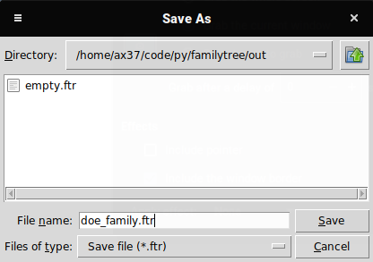

# Family Tree
This is the repo for my project for the COVID-19 global hackathon, a GUI app for creating and visualizing family trees.

[Project link](https://devpost.com/software/family-tree-brcwnt)

## Inspiration
I started gathering information about my family a year ago and found it hard to organise and visualise. I decided to participate in this hackathon to create a tool that makes it simple to create family trees and learn `pysimplegui`.

## What it does
It gets input from the user and creates a visual representation of their family tree.

## How I built it
I used Python and the libraries `pysimplegui` and `graphviz`.

## Challenges I ran into
`pysimplegui` is, in fact, not simple for complex projects. It's impossible to update a window's contents after creating it or create an interactive node-based interface. I had to work around those limitations and learn the proper way to approach this problem.

## Accomplishments that I'm proud of
I used a window-based model for the GUI and created a program with its own custom save file format. 

## What I learned
I learned how to use `pysimplegui` and `graphviz`.

## License
MIT/BSD 2-clause License.

## How to run
```
pip3 install pysimplegui graphviz
git clone https://github.com/neverix/family-tree
cd family-tree
python3 main.py
```

## Screenshots





